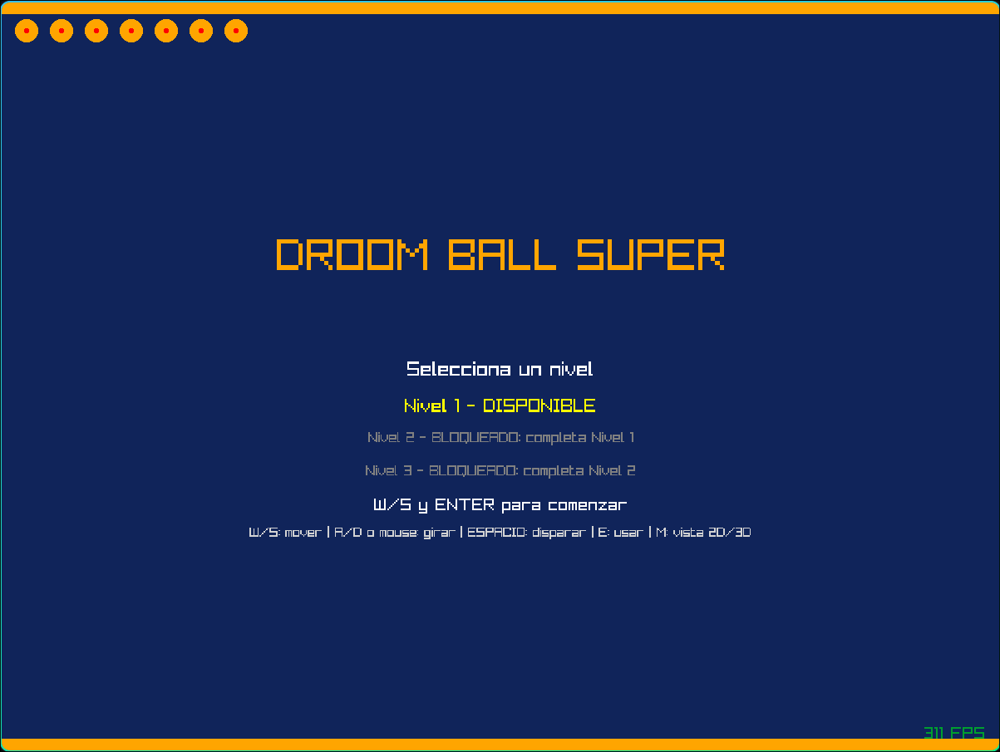
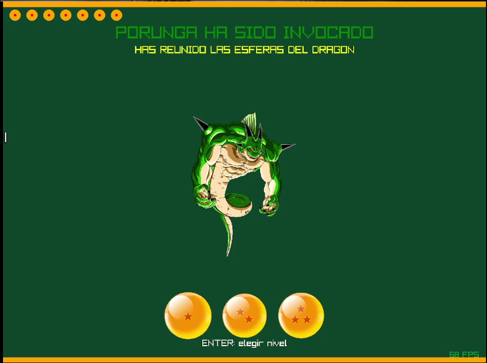

# Droom Ball Super

Ray caster pseudo-3D (estilo *Wolfenstein 3D* / DOOM) implementado en Rust con
`raylib`, con temática de **Dragon Ball Super**: paredes texturizadas,
enemigos billboard, cápsulas de salud y ki, tres laberintos jugables y una
mecánica de combate para activar la salida y llegar a la meta de Porunga.

## Video

**https://youtu.be/LyaE42f7A3Q**

## Screenshots

### Pantalla de bienvenida


### Pantalla de victoria


## Cómo correr el proyecto

### Requisitos

- Rust + Cargo
- Dependencias de sistema de `raylib`
- Los recursos de `assets/` y los mapas de `maps/`

### Build y ejecución

```bash
cargo run --release
```

`--release` importa bastante: el programa ejecuta raycasting para cada columna
del framebuffer, proyecta sprites, actualiza el minimapa y reproduce audio en
cada cuadro. El perfil de desarrollo ya tiene optimizaciones activadas, pero la
versión de release es la adecuada para grabar el video de entrega.

### Tests

```bash
cargo test
```

También puedes comprobar que el proyecto compila sin ejecutarlo:

```bash
cargo check
```

## Controles

| Acción | Tecla / Input |
|--------|---------------|
| Avanzar / retroceder | `W` / `S` |
| Rotar cámara (izquierda/derecha) | `A` / `D`, o mouse horizontal |
| Disparar | `SPACE` o clic izquierdo |
| Activar interruptor | `E` |
| Mostrar vista 2D / 3D | `M` |
| Navegar menú de niveles | `W` / `S` |
| Confirmar / continuar | `ENTER` |
| Volver al menú desde derrota | `L` |
| Cerrar ventana | `Esc` o cerrar la ventana |

## Mecánica de juego

1. **Pantalla de bienvenida**: selecciona uno de los tres niveles. El nivel 2
   y el nivel 3 se desbloquean al superar el nivel anterior.
2. **Gameplay**: recorre el laberinto en 3D sin atravesar paredes, recoge
   botiquines y cápsulas de ki, y elimina a todos los enemigos.
3. **Combate**: dispara con `SPACE` o clic izquierdo. Los enemigos persiguen al
   jugador cuando tienen línea de visión y lanzan proyectiles de ki.
4. **Meta**: activa el interruptor con `E`, derrota a los enemigos y alcanza
   la celda de Porunga para terminar el nivel.
5. **Pantallas de resultado**: al completar un nivel aparece la pantalla de
   éxito; al completar el tercero se muestra la victoria final. Si la vida se
   agota, aparece Yamcha y se puede reiniciar o volver al menú.

## Estructura

- `level.rs` — carga los mapas de arte Unicode, los convierte a una cuadrícula
  navegable, ubica automáticamente inicio y meta, y encuentra celdas alcanzables.
- `combat.rs` — enemigos, proyectiles, botiquines, munición, colisiones de
  enemigos e interacción con el interruptor.
- `player.rs` — estado del jugador (posición, ángulo y FOV).
- `caster.rs` — `cast_ray` mediante DDA; identifica la celda impactada y los
  datos necesarios para corregir el fish-eye y texturizar la pared.
- `world_renderer.rs` — paredes texturizadas por columna, cielo, suelo, sprites
  billboard con z-buffer, proyectiles y mira central.
- `sprites.rs` — proyección de sprites, oclusión contra paredes y disparos a
  enemigos usando distancia y ángulo.
- `textures.rs` — carga de cielo, personajes, ítems, meta y texturas alternas
  de paredes desde `assets/wall/`.
- `map_view.rs` — mapa 2D y minimapa en esquina, con jugador, enemigos, ítems
  y meta.
- `hud.rs` — barras de vida y munición, más contador de enemigos restantes.
- `input.rs` — teclado y mouse para movimiento, rotación horizontal y disparo.
- `framebuffer.rs` — framebuffer de los laboratorios de gráficas y pantallas
  de bienvenida, éxito, derrota y victoria.
- `main.rs` — ciclo principal, audio, selección/bloqueo de niveles y cambios de
  estado de la partida.

### Assets esperados

```
assets/
├── wall/             # texturas alternas para los bloques de pared
├── sky.png            # cielo del mundo 3D
├── porunga.png        # meta del nivel
├── frieza.png         # enemigo normal
├── jiren.png          # enemigo resistente
├── hermitaño.png      # botiquín
├── ki.png             # cápsula de munición
├── ki blast.png       # proyectil enemigo
├── sphere1.png        # esfera de los niveles
├── sphere2.png
├── sphere3.png
├── yamcha.png         # pantalla de derrota
├── holdontight.mp3    # música de fondo
├── shoot.mp3          # efecto de disparo
├── hit.mp3            # impacto
├── cura.mp3           # curación
├── ki.mp3             # recolección de munición
└── shenron.mp3        # interruptor, meta y victoria
maps/
├── mapa1.txt
├── mapa2.txt
└── mapa3.txt
```

## Notas de diseño

- El FOV está fijo en 60 grados (`PI / 3.0`).
- El raycaster usa DDA y la distancia de cada rayo se corrige con el coseno de
  la diferencia angular, reduciendo el efecto de ojo de pez.
- Cada pared usa una textura de `assets/wall/` escogida a partir de la celda del
  mapa; la meta `g` conserva específicamente la textura de Porunga.
- Los sprites se escalan inversamente a su distancia y se dibujan solo si están
  en el FOV. El z-buffer evita que aparezcan encima de una pared cercana.
- Las colisiones del jugador se validan antes de actualizar su celda, por lo
  que no puede atravesar los muros del laberinto.
- La música se reproduce como stream y se actualiza cada cuadro; los efectos
  se cargan como sonidos independientes para disparos, daño e ítems.

## Autor

**Luis Angel Girón Arévalo — 24753**.
